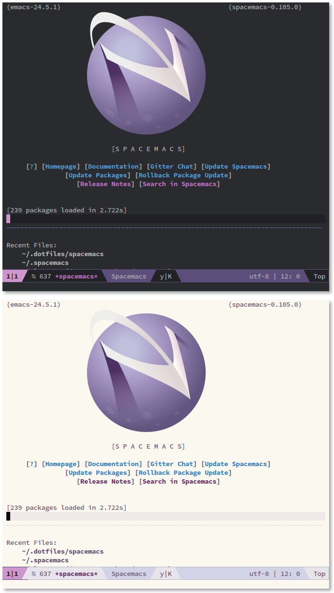
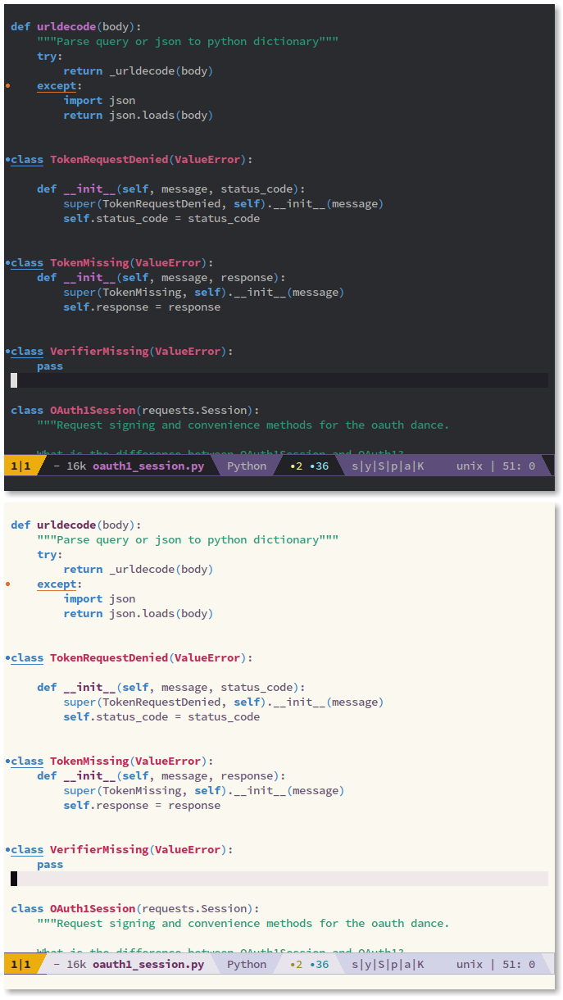

# spacemax-theme



**spacemax-theme** is a fork of spacemacs-theme by Nasser Alshammari. That theme 
is an Emacs colour theme that started as a theme for 
[spacemacs](https://github.com/syl20bnr/spacemacs). Like spacemacs-theme, 
spacemax-theme comes with dark and light variants and it should work well with 
256-colour terminals.

## Screenshots



## Installation

spacemax-theme is designed to be installed as a custom theme in your
`.emacs.d/private/themes` directory.

```sh
mkdir -p ~/.emacs.d/private/themes
cd ~/.emacs.d/private/themes
git clone git@github.com:pyrmont/spacemax-theme
```

## Limitations

Due to the way in which the light and dark variants share common code, the theme
must be placed in `~/.emacs.d/private/themes/spacemax-theme`.

## Licence

spacemax-theme is licensed under the GPL. See `LICENCE.md` for more details.

